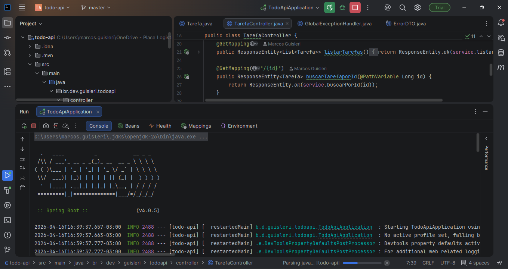
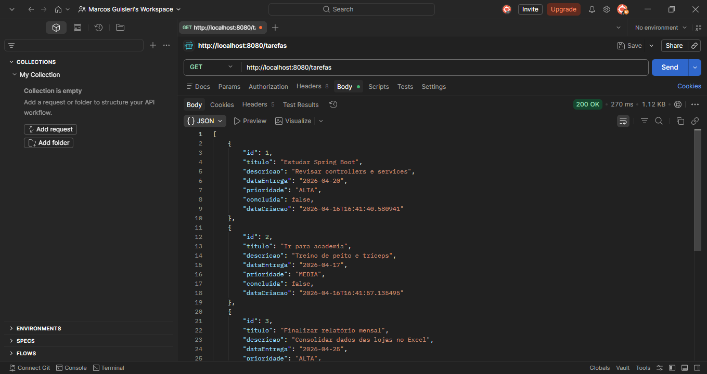
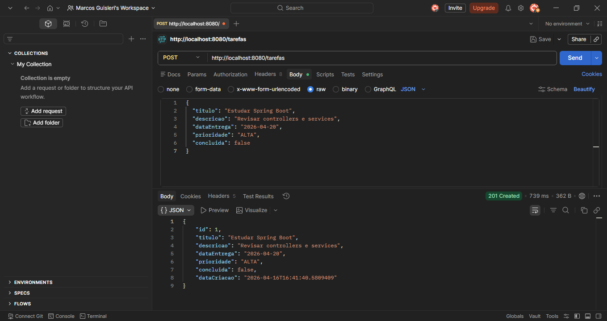

# ✅ Todo API


API REST de gerenciamento de tarefas desenvolvida para consolidar os fundamentos do Spring Boot — estrutura de pacotes, JPA, tratamento de exceções e boas práticas de desenvolvimento.

---

## 📸 Preview

| IntelliJ IDEA | GET /tarefas | POST /tarefas |
|---|---|---|
|  |  |  |

---

## 🏗️ Estrutura do Projeto

```
src/main/java/br/dev/guisleri/todoapi/
├── controller/
│   ├── TarefaController.java        # Endpoints REST
│   └── GlobalExceptionHandler.java  # Tratamento global de erros
├── dto/
│   └── ErrorDTO.java                # Resposta padronizada de erros
│   └── TarefaRequestDTO.java        # Converte DTO em Entity
│   └── TarefaResponseDTO.java       # Converte Entity em DTO
├── exception/
│   └── TarefaNaoEncontrada.java     # Exception customizada
├── model/
│   ├── Tarefa.java                  # Entidade JPA
│   └── Prioridade.java              # Enum de prioridades
├── repo/
│   └── TarefaRepo.java              # Repository (Spring Data)
└── service/
    ├── ITarefaService.java          # Interface do serviço
    └── TarefaService.java           # Implementação com regras de negócio
```

---

## 📋 Endpoints

Base URL: `http://localhost:8080`

| Método | Rota | Descrição |
|--------|------|-----------|
| `GET` | `/tarefas` | Lista todas as tarefas |
| `GET` | `/tarefas/{id}` | Busca uma tarefa por ID |
| `POST` | `/tarefas` | Cria uma nova tarefa |
| `PUT` | `/tarefas/{id}` | Atualiza uma tarefa existente |
| `DELETE` | `/tarefas/{id}` | Remove uma tarefa |

---

## 📦 Exemplo de Payload

**POST /tarefas**
```json
{
  "titulo": "Estudar Spring Boot",
  "descricao": "Ver aula de JPA e Repository",
  "dataEntrega": "2025-12-01T00:00:00",
  "prioridade": "ALTA",
  "concluida": false
}
```

**Prioridades aceitas:** `BAIXA` | `MEDIA` | `ALTA`

---

## ⚠️ Respostas de Erro

Erros são retornados de forma padronizada via `GlobalExceptionHandler`:

```json
{
  "mensagem": "Tarefa não encontrada - id: 99"
}
```

| Status | Situação |
|--------|----------|
| `404` | Tarefa não encontrada |
| `400` | Dados inválidos na requisição |

---

## 🛠️ Tecnologias

- **Java 25**
- **Spring Boot 4.0.5**
- **Spring Data JPA** — persistência e repositório
- **H2 Database** — banco em memória para desenvolvimento
- **Lombok** — redução de boilerplate
- **Maven** — gerenciamento de dependências

---

## 🚀 Como rodar

**Pré-requisitos:** Java 25 e Maven instalados.

```bash
# Clone o repositório
git clone https://github.com/guisleri/todo-api.git

# Entre na pasta
cd todo-api

# Rode a aplicação
./mvnw spring-boot:run
```

A API estará disponível em `http://localhost:8080`.

O console do H2 pode ser acessado em `http://localhost:8080/h2-console`.

---

## 🗺️ Próximos passos

- [ ] Adicionar Spring Security com autenticação JWT
- [ ] Migrar para PostgreSQL
- [ ] Documentar com Swagger/OpenAPI

---

## 👨‍💻 Autor

Desenvolvido por **Guisleri** durante a pós-graduação em desenvolvimento backend.
